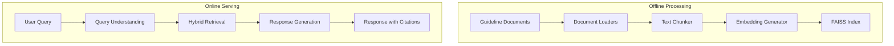

# HeartSafe RAG: Guideline-Driven Cardiology Agent

A Retrieval-Augmented Generation (RAG) system for zero-hallucination heart failure decision support, grounded exclusively in AHA/ACC Heart Failure Guidelines.

[](https://www.python.org/downloads/)
[](LICENSE)
[](https://github.com/psf/black)

## 🚀 Features

- **Evidence-Based Responses**: Every response is grounded in AHA/ACC Heart Failure Guidelines
- **Zero Hallucinations**: Strict retrieval enforcement ensures no made-up information
- **Hybrid Retrieval**: Combines semantic search (FAISS) with keyword matching (BM25)
- **Reproducible**: Deterministic behavior across deployments
- **Production-Ready**: FastAPI backend with health checks and monitoring
- **Comprehensive Evaluation**: Built-in evaluation framework for model performance

## 🏗️ Architecture



## 🛠️ Installation

1. **Clone the repository**
   ```bash
   git clone https://github.com/MohamedFakhry2007/heart_safe_rag.git
   cd heart_safe_rag
   ```

2. **Install dependencies**
   ```bash
   # Install Poetry if you don't have it
   pip install poetry
   
   # Install project dependencies
   poetry install
   ```

3. **Set up environment variables**
   ```bash
   cp .env.example .env
   # Edit .env with your API keys and configurations
   ```

## 🚀 Quick Start

1. **Ingest Guidelines**
   ```bash
   poetry run python ingest.py "data/guidelines/aha_guidelines_2022.pdf" --output-dir "faiss_index" --verbose
   ```

2. **Start the API server**
   ```bash
   poetry run uvicorn heartsafe_rag.api:app --reload
   ```

3. **Query the API**
   ```bash
   curl -X POST "http://localhost:8000/chat" \
        -H "Content-Type: application/json" \
        -d '{"query": "What are the latest guidelines for heart failure management?"}'
   ```

## 🧪 Running Tests

```bash
# Run all tests
poetry run pytest

# Run tests with coverage
poetry run pytest --cov=heartsafe_rag tests/
```

## 📂 Project Structure

```
.
├── data/                   # Data and guideline documents
│   └── guidelines/         # AHA/ACC guideline documents
├── faiss_index/            # FAISS vector store
├── prompts/                # Prompt templates
├── eval/                   # Evaluation scripts and datasets
│   └── data/               # Golden dataset for evaluation
├── src/                    # Source code
│   └── heartsafe_rag/      # Main package
│       ├── api.py          # FastAPI application
│       ├── generation.py   # Response generation logic
│       ├── retrieval.py    # Document retrieval components
│       └── utils/          # Utility functions
├── tests/                  # Test suite
├── .env.example            # Example environment variables
├── pyproject.toml          # Project dependencies
└── README.md               # This file
```

## 📚 Documentation

For detailed documentation, please refer to:

- [Design Document](design.md) - System architecture and design decisions
- [API Documentation](#) - Auto-generated API docs (available when running locally)

## 🙏 Acknowledgments

- American Heart Association (AHA) and American College of Cardiology (ACC) for their heart failure guidelines
- The open-source community for the amazing tools and libraries that made this project possible
