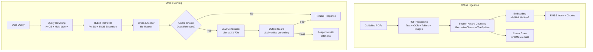

# HeartSafe RAG: Guideline-Driven Cardiology Agent

A Retrieval-Augmented Generation (RAG) system for zero-hallucination heart failure decision support, grounded exclusively in AHA/ACC Heart Failure Guidelines.

[](https://www.python.org/downloads/)
[](LICENSE)
[](https://docs.astral.sh/ruff/)
[](http://mypy-lang.org/)
[](https://langfuse.com)

## Features

- **Evidence-Based Responses**: Every response is grounded in 2022 AHA/ACC Heart Failure Guidelines.
- **Zero Hallucinations**: Strict retrieval enforcement + LLM guard layer ensures no made-up information; the model refuses to answer if guidelines are missing.
- **Hybrid Retrieval**: Combines semantic search (FAISS) with keyword matching (BM25) for high-precision context fetching.
- **Cross-Encoder Re-Ranking**: BAAI/bge-reranker-v2-m3 re-ranks initial results for maximum precision.
- **Query Rewriting**: HyDE (Hypothetical Document Embeddings) + Multi-Query generation expand queries for better retrieval coverage.
- **OCR Support**: Tesseract OCR for scanned PDFs and image extraction from guideline documents.
- **Table & Image Extraction**: Tables extracted via pdfplumber, images extracted via PyMuPDF.
- **Output Guard Layer**: LLM-as-a-judge verifies each response is fully grounded before returning it.
- **Evaluation Pipeline**: Integrated Langfuse experiment runner with LLM-as-a-Judge for measuring clinical accuracy.
- **Production-Ready**: FastAPI backend with health checks, structured logging, and Docker support.
- **Chat Interface**: Built-in web UI served via FastAPI + Jinja2 templates.

## Architecture


```mermaid
flowchart TB
    subgraph OFFLINE["Offline Ingestion"]
        A[Guideline PDFs] --> B[PDF Processing<br/>Text + OCR + Tables + Images]
        B --> C[Section-Aware Chunking<br/>RecursiveCharacterTextSplitter]
        C --> D[Embedding<br/>all-MiniLM-L6-v2]
        D --> E[FAISS Index + Chunks]
        C --> F[Chunk Store<br/>for BM25 rebuild]
    end

    subgraph ONLINE["Online Serving"]
        G[User Query] --> H[Query Rewriting<br/>HyDE + Multi-Query]
        H --> I[Hybrid Retrieval<br/>FAISS + BM25 Ensemble]
        I --> J[Cross-Encoder<br/>Re-Ranker]
        J --> K{Guard Check:<br/>Docs Retrieved?}
        K -->|Yes| L[LLM Generation<br/>Llama-3.3-70b]
        K -->|No| N[Refusal Response]
        L --> M[Output Guard<br/>LLM verifies grounding]
        M -->|Pass| O[Response with<br/>Citations]
        M -->|Fail| N
    end
```

## Installation

### Clone the repository

```bash
git clone https://github.com/MohamedFakhry2007/heart_safe_rag.git
cd heart_safe_rag
```

### Install dependencies

```bash
# Install Poetry if you don't have it
pip install poetry

# Install project dependencies
poetry install
```

### Set up environment variables

```bash
cp .env.example .env
```

Edit `.env` and add your keys:

```env
GROQ_API_KEY=gsk_...
LANGFUSE_PUBLIC_KEY=pk-lf-...
LANGFUSE_SECRET_KEY=sk-lf-...
LANGFUSE_HOST=https://cloud.langfuse.com

# Optional: OCR settings
TESSERACT_CMD=tesseract
OCR_ENABLED=true

# Optional: Log level
LOG_LEVEL=INFO
```

## Quick Start

### 1. Ingest Guidelines

Parse PDFs and build the vector index. Supports single file or directory:

```bash
# Ingest all PDFs from data/guidelines/
make ingest
# or manually:
poetry run python ingest.py data/guidelines/ --output data/vector_store

# Ingest a single PDF
poetry run python ingest.py path/to/guideline.pdf
```

### 2. Start the API Server

Launch the backend and the web Chat UI.

```bash
make run
# or:
make api
# or manually:
poetry run uvicorn heartsafe_rag.api:app --reload
```

- **Chat UI**: Open http://localhost:8000
- **API Docs** (Swagger): Open http://localhost:8000/docs
- **Health Check**: http://localhost:8000/health

### 3. Run Evaluations

Upload the golden dataset to Langfuse and run the evaluation experiment:

```bash
# Upload golden dataset to Langfuse (one-time setup)
poetry run python -m heartsafe_rag.upload_dataset

# Run evaluation experiment with LLM-as-a-Judge
poetry run python -m heartsafe_rag.evaluate --dataset-name heartsafe_golden_dataset_v1 --delay 5
```

## Commands Reference

| Command | Description |
|---------|-------------|
| `make install` | Install poetry dependencies |
| `make setup` | Install deps + create data directories |
| `make ingest` | Run ingestion pipeline on `data/guidelines/` |
| `make run` / `make api` | Start FastAPI server (localhost:8000) |
| `make eval` | Run mock golden dataset evaluation |
| `make test` | Run pytest suite |
| `make format` | Auto-format code with ruff |
| `make check` | Lint with ruff + type-check with mypy |

## API Endpoints

| Endpoint | Method | Description |
|----------|--------|-------------|
| `/` | GET | Chat UI (HTML) |
| `/health` | GET | Health check (returns service status) |
| `/chat` | POST | Ask a clinical question |

### `/chat` Example

```json
{
  "query": "What are the four medication classes in GDMT for HFrEF?"
}
```

Response:

```json
{
  "answer": "The four medication classes are...",
  "sources": [
    { "content": "GDMT for HFrEF includes...", "source": "2022-AHA-HF-Guideline.pdf" }
  ]
}
```

## Testing

```bash
make test
# or:
poetry run pytest
```

The test suite includes:
- **Unit tests**: chunking boundaries, embedding consistency, retriever rebuild logic
- **Integration tests**: end-to-end query -> retrieval -> answer pipeline
- **Fixtures**: synthetic PDFs (text-only, multi-page, tables, images, scanned, unicode, corrupt)

## Project Structure

```
HeartSafe-RAG/
├── ingest.py                       # CLI entry point for ingestion
├── evaluation.py                   # Simple mock-based evaluation script
├── Makefile                        # Command shortcuts
├── pyproject.toml                  # Poetry config & dependencies
├── docker-compose.yml              # Container orchestration
├── Dockerfile                      # Container image
├── .github/workflows/ci.yml        # CI pipeline (ruff + mypy + pytest)
├── data/
│   ├── guidelines/                 # PDF guideline source files
│   ├── vector_store/               # FAISS index + chunks + BM25 index
│   └── bm25_index.pkl              # BM25 index (legacy location)
├── eval/
│   ├── data/golden_dataset.json    # 50+ QA pairs for evaluation
│   └── results/                    # Evaluation reports
├── faiss_index/                    # Legacy index directory
├── prompts/
│   └── system_prompt.txt           # System prompt with safety rules
├── src/
│   └── heartsafe_rag/
│       ├── __init__.py             # Package initialization
│       ├── api.py                  # FastAPI server + endpoints
│       ├── config.py               # Pydantic settings (.env)
│       ├── chunking.py             # Guideline-aware text chunker
│       ├── ingestion.py            # PDF processing pipeline
│       ├── retrieval.py            # Hybrid retriever (FAISS+BM25+Re-ranker)
│       ├── generation.py           # Guarded generation chain
│       ├── evaluate.py             # Langfuse evaluation experiment runner
│       ├── upload_dataset.py       # Upload golden dataset to Langfuse
│       ├── schemas.py              # Request/response models
│       ├── exceptions.py           # Custom exception hierarchy
│       ├── templates/
│       │   └── chat.html           # Chat UI template
│       └── utils/
│           └── logger.py           # Structured logging config
└── tests/
    ├── conftest.py                 # Fixtures (synthetic PDFs, test index)
    ├── test_chunking.py
    ├── test_generation.py
    ├── test_ingestion.py
    ├── test_integration.py
    └── test_retrieval.py
```

## Configuration

Key settings (from `src/heartsafe_rag/config.py`):

| Setting | Default | Description |
|---------|---------|-------------|
| `LLM_MODEL` | `llama-3.3-70b-versatile` | Groq LLM for generation |
| `LLM_TEMPERATURE` | `0.0` | Generation temperature |
| `EMBEDDING_MODEL` | `sentence-transformers/all-MiniLM-L6-v2` | Embedding model |
| `CHUNK_SIZE` | `500` | Text chunk size (chars) |
| `CHUNK_OVERLAP` | `100` | Chunk overlap (chars) |
| `INITIAL_RETRIEVAL_K` | `30` | Initial candidates per retriever |
| `RERANK_TOP_K` | `7` | Final results after re-ranking |
| `RERANKER_MODEL` | `BAAI/bge-reranker-v2-m3` | Cross-encoder re-ranker |
| `HYBRID_WEIGHTS` | `[0.4, 0.6]` | [BM25 weight, FAISS weight] |
| `ENABLE_HYDE` | `true` | Hypothetical Document Embeddings |
| `ENABLE_MULTI_QUERY` | `true` | Multi-Query expansion |
| `MULTI_QUERY_COUNT` | `3` | Number of query variants |
| `OCR_ENABLED` | `true` | Tesseract OCR for scanned PDFs |

## Docker Deployment

```bash
docker compose up --build
```

This starts the FastAPI server on port 8000, mounting `./data` and `./src` as volumes.

## Tech Stack

- **LLM**: Llama-3.3-70b-versatile (via Groq) for high-fidelity medical reasoning
- **Embeddings**: all-MiniLM-L6-v2 via sentence-transformers
- **Vector Store**: FAISS (dense) + BM25 (sparse) with EnsembleRetriever
- **Re-Ranker**: BAAI/bge-reranker-v2-m3 cross-encoder
- **Backend**: FastAPI + Jinja2 templates
- **Observability**: Full trace logging via Langfuse
- **Code Quality**: Ruff (linting + formatting) + mypy (strict type checking)
- **Dependencies**: Poetry

## Acknowledgments

American Heart Association (AHA) and American College of Cardiology (ACC) for the clinical source material.
