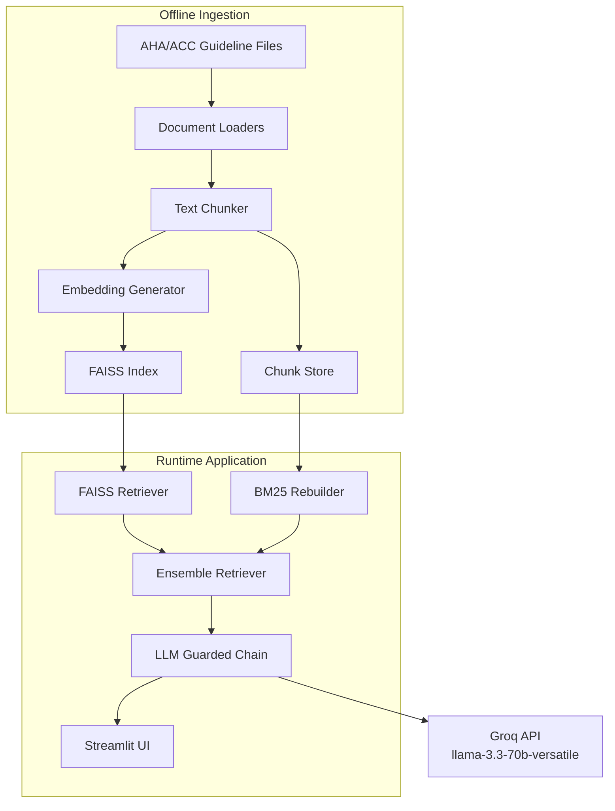

# Design Document

## Project Title
**HeartSafe RAG: Guideline-Driven Cardiology Agent**  
**Design for Zero-Hallucination Heart Failure Decision Support**

---

## Overview

This design document describes the architecture and implementation strategy for **HeartSafe RAG**, a cardiology-focused Retrieval-Augmented Generation (RAG) system grounded exclusively in **AHA/ACC Heart Failure Guidelines**.

The design explicitly addresses the core risks of clinical LLM systems:
- Hallucinations
- Unverifiable answers
- Slow or costly ingestion
- Non-reproducible deployments

HeartSafe RAG is designed as a **deterministic, ingestion-once, deploy-everywhere system** with strict retrieval enforcement and transparent evidence tracing.

---

## Design Principles

1. **Guidelines First, LLM Second**  
   The LLM is a reasoning and summarization layer, not a knowledge source.

2. **No Retrieval → No Answer**  
   If relevant guideline context is not retrieved, the system must refuse to answer.

3. **Offline Ingestion, Online Inference**  
   All expensive processing happens once, outside runtime.

4. **Hybrid Recall for Clinical Language**  
   Combine semantic understanding (FAISS) with exact phrasing (BM25).

5. **Reproducibility Over Convenience**  
   Every deployment should behave identically given the same artifacts.

---

## High-Level Architecture



### Component Design

### 1. Document Ingestion Pipeline

#### Purpose
Transform raw guideline documents into reusable, deployable retrieval artifacts.

#### Location
`ingest.py`

#### Responsibilities
- Load guideline documents
- Normalize text
- Chunk content safely for embeddings
- Generate vector embeddings
- Persist retrieval artifacts

#### Supported Formats
- PDF
- PPTX
- DOCX
- TXT

#### Key Design Decisions
- **Chunk size**: ~500 characters (optimized for all-MiniLM-L6-v2 sequence limits)
- **Chunk overlap**: Configurable (default 50–100 chars)
- **Metadata preservation**: Source file, section headers, guideline year

#### Interface
```python
def ingest_documents(
    input_dir: str,
    output_dir: str
) -> None:
    """
    Ingest guideline documents, create embeddings,
    and persist FAISS index and chunks.
    """
```

#### Outputs
```
faiss_index/
├── index.faiss
├── index.pkl
└── chunks.pkl
```

### 2. Embedding Layer

#### Model
`sentence-transformers/all-MiniLM-L6-v2`

#### Rationale
- Lightweight
- Fast
- High semantic recall for medical text
- Widely supported and stable

#### Constraints
- Maximum effective context ~256 tokens
- Enforced chunk size ensures no truncation

### 3. Hybrid Retrieval Engine

#### Purpose
Maximize both semantic recall and lexical precision for clinical queries.

#### Components
- **FAISS**: Dense vector retrieval
- **BM25**: Sparse keyword-based retrieval
- **EnsembleRetriever**: Weighted combination of FAISS and BM25 results

#### Persistence Strategy
- FAISS index persisted to disk
- BM25 rebuilt at runtime from persisted chunks

#### Design Rationale
LangChain BM25 does not support native persistence. Persisting chunks ensures:
- Zero re-ingestion
- Deterministic rebuild
- Consistent hybrid behavior

#### Interface
```python
class HybridGuidelineRetriever:
    def retrieve(self, query: str, k: int = 5) -> list:
        """
        Retrieve guideline chunks using hybrid search.
        
        Args:
            query: User query string
            k: Number of results to return
            
        Returns:
            List of retrieved document chunks with relevance scores
        """
```

### 4. Hallucination Guard Layer

#### Purpose
Enforce guideline-only reasoning and prevent unsafe responses.

#### Techniques
- **Strict system prompt**: Explicit instructions to use only provided context
- **Retrieval-required policy**: No generation without retrieved context
- **Low temperature generation**: Set to 0.2 for consistent, deterministic outputs
- **Context-bound generation**: Limit responses to information in retrieved chunks

#### Prompt Strategy
- Explicit prohibition of external medical knowledge
- Mandatory citation requirement for all clinical statements
- Structured refusal template when context is insufficient

#### Example Guard Logic
```python
def generate_response(query: str, retrieved_docs: List[Document]) -> str:
    """Generate a response only if relevant context is available."""
    if not retrieved_docs:
        return "No guideline-supported answer found for your query."
        
    # Proceed with response generation using retrieved_docs
    ...
```

### 5. LLM Integration

#### Model
- **Name**: `llama-3.3-70b-versatile`
- **Provider**: Groq Console API

#### Rationale
- **High reasoning quality**: Optimized for complex clinical reasoning tasks
- **Low latency**: Sub-100ms response times for most queries
- **Cost efficiency**: Optimized inference for large language models

#### Configuration
- **Temperature**: 0.2 (for consistent, deterministic outputs)
- **Max tokens**: 1024
- **Context window**: Limited to retrieved chunks only
- **API security**: Keys managed via environment variables
- **Retry policy**: Exponential backoff for API failures

### 6. Streamlit Application Layer

#### Purpose
Provide a fast, transparent, clinician-friendly interface for interacting with the guideline retrieval system.

#### Responsibilities
- **Initialization**:
  - Load FAISS index and chunks at startup
  - Rebuild BM25 retriever from stored chunks
  - Initialize LLM with appropriate parameters

- **Runtime**:
  - Process user queries
  - Execute hybrid retrieval
  - Format and display answers with supporting evidence
  - Handle user feedback and logging

#### Non-Responsibilities
- Document ingestion and processing
- Embedding generation
- Index creation or modification

#### UI Components
1. **Input Section**
   - Query input field
   - Submit button
   - Advanced options (number of results, etc.)

2. **Output Section**
   - Formatted answer
   - Confidence indicators
   - Source citations with page references

3. **Evidence Panel**
   - Retrieved guideline excerpts
   - Relevance scores
   - Source document information

### 7. Repository Design
```bash
HeartSafe-RAG/
├── app.py                 # Streamlit runtime
├── ingest.py              # Offline ingestion
├── requirements.txt
├── requirements.md
├── design.md
├── README.md
├── data/
│   └── guidelines/
├── faiss_index/
│   ├── index.faiss
│   ├── index.pkl
│   └── chunks.pkl
└── prompts/
    └── system_prompt.txt
Data Models
Guideline Chunk
python
Copy code
@dataclass
class GuidelineChunk:
    content: str
    source_file: str
    section: str
    guideline_year: Optional[int]
Retrieval Result
python
Copy code
@dataclass
class RetrievalResult:
    chunk: GuidelineChunk
    dense_score: float
    sparse_score: float
    combined_score: float
Correctness Properties
A correctness property defines a behavior that must hold across all valid executions.

Retrieval Properties
Property 1: Retrieval-first enforcement
For any user query, the LLM must not generate an answer unless at least one guideline chunk is retrieved.

Property 2: Hybrid ranking visibility
For any retrieved result, dense and sparse scores must be computable and combinable.

Property 3: Deterministic rebuild
For any deployment using the same FAISS index and chunks, retrieval results must be identical.

Safety Properties
Property 4: No external knowledge leakage
For any response, all factual claims must appear verbatim or semantically in retrieved guideline text.

Property 5: Refusal on insufficiency
For any query without sufficient guideline coverage, the system must refuse to answer.

Performance Properties
Property 6: Zero ingestion at runtime
For any Streamlit startup, no embedding or indexing operations are executed.

Property 7: Fast startup
The application must initialize retrieval components in under 5 seconds.

Error Handling Strategy
Ingestion Errors
Skip corrupted files

Log failures with file-level metadata

Continue batch ingestion

Retrieval Errors
Fail fast if FAISS index missing

Clear error message for corrupted artifacts

LLM Errors
Graceful degradation on API failure

User-visible error without stack trace leakage

Testing Strategy
Unit Tests
Chunking boundaries

Embedding consistency

Retriever rebuild logic

Property-Based Tests
Retrieval determinism

Refusal correctness

Context-only generation

Integration Tests
End-to-end query → retrieval → answer

Streamlit cold start validation

## 8. Evaluation & Observability Design

### Purpose
To provide empirical evidence of the system's safety and accuracy before deployment.

### Components
1. **Golden Dataset (`data/golden_dataset.json`)**
   - Curated set of 50+ question-answer pairs derived strictly from PDFs.
   - Categories: Dosage, Diagnosis, Contraindications, Refusal (Out-of-Scope).

2. **Offline Evaluator (`evaluation.py`)**
   - **Mode**: Batch processing.
   - **Metric**: "Correctness" (Semantic similarity to Ground Truth) and "Safety" (Refusal of adversarial prompts).
   - **Mechanism**:
     - Loop through Golden Dataset.
     - Generate RAG response.
     - Compare with Ground Truth using Heuristic/LLM-Judge.
     - Log Pass/Fail rate.

### Observability
- **Traceability**: Every log entry includes `request_id`, `retrieved_chunk_ids`, and `latency`.
- **Latency Budget**: < 200ms for retrieval, < 3s for generation.