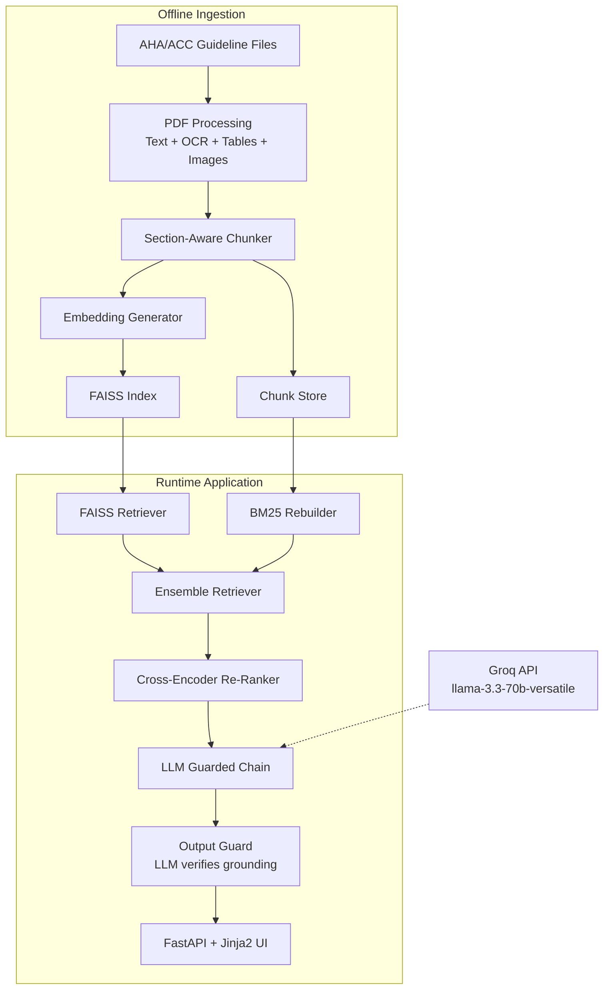

# Design Document

## Project Title
**HeartSafe RAG: Guideline-Driven Cardiology Agent**  
**Design for Zero-Hallucination Heart Failure Decision Support**

---

## Overview

This design document describes the architecture and implementation strategy for **HeartSafe RAG**, a cardiology-focused Retrieval-Augmented Generation (RAG) system grounded exclusively in **AHA/ACC Heart Failure Guidelines**.

The design explicitly addresses the core risks of clinical LLM systems:
- Hallucinations
- Unverifiable answers
- Slow or costly ingestion
- Non-reproducible deployments

HeartSafe RAG is designed as a **deterministic, ingestion-once, deploy-everywhere system** with strict retrieval enforcement and transparent evidence tracing.

---

## Design Principles

1. **Guidelines First, LLM Second**  
   The LLM is a reasoning and summarization layer, not a knowledge source.

2. **No Retrieval → No Answer**  
   If relevant guideline context is not retrieved, the system must refuse to answer.

3. **Offline Ingestion, Online Inference**  
   All expensive processing happens once, outside runtime.

4. **Hybrid Recall for Clinical Language**  
   Combine semantic understanding (FAISS) with exact phrasing (BM25).

5. **Reproducibility Over Convenience**  
   Every deployment should behave identically given the same artifacts.

---

## High-Level Architecture


```mermaid
graph TB
    subgraph "Offline Ingestion"
        A[AHA/ACC Guideline Files] --> B[PDF Processing<br/>Text + OCR + Tables + Images]
        B --> C[Section-Aware Chunker]
        C --> D[Embedding Generator]
        D --> E[FAISS Index]
        C --> F[Chunk Store]
    end

    subgraph "Runtime Application"
        E --> G[FAISS Retriever]
        F --> H[BM25 Rebuilder]
        G --> I[Ensemble Retriever]
        H --> I
        I --> J[Cross-Encoder Re-Ranker]
        J --> K[LLM Guarded Chain]
        K --> L[Output Guard<br/>LLM verifies grounding]
        L --> M[FastAPI + Jinja2 UI]
    end

    N[Groq API<br/>llama-3.3-70b-versatile] -.-> K
```

### Component Design

### 1. Document Ingestion Pipeline

#### Purpose
Transform raw guideline documents into reusable, deployable retrieval artifacts.

#### Location
`src/heartsafe_rag/ingestion.py` and `ingest.py` (CLI entry point)

#### Responsibilities
- Load guideline documents
- Extract text, tables (pdfplumber), and images (PyMuPDF)
- OCR scanned PDF pages (Tesseract)
- Normalize text
- Section-aware chunking
- Generate vector embeddings
- Persist retrieval artifacts

#### Supported Formats
- PDF (text-based, scanned, image-containing)

#### Key Design Decisions
- **Chunk size**: 500 characters (optimized for all-MiniLM-L6-v2 sequence limits)
- **Chunk overlap**: 100 characters
- **Metadata preservation**: Source file, section headers, guideline year, recommendation markers
- **Multi-modal extraction**: Tables via pdfplumber, images via PyMuPDF, OCR via Tesseract

#### Interface
```python
def process_single_pdf(pdf_path: Path, output_dir: Path) -> None: ...
def process_batch(input_dir: Path, output_dir: Path) -> None: ...
```

#### Outputs
```
data/vector_store/
├── index.faiss
├── index.pkl
├── chunks.pkl
└── bm25_index.pkl
```

### 2. Embedding Layer

#### Model
`sentence-transformers/all-MiniLM-L6-v2`

#### Rationale
- Lightweight
- Fast
- High semantic recall for medical text
- Widely supported and stable

#### Constraints
- Maximum effective context ~256 tokens
- Enforced chunk size ensures no truncation

### 3. Hybrid Retrieval Engine

#### Purpose
Maximize both semantic recall and lexical precision for clinical queries.

#### Components
- **FAISS**: Dense vector retrieval
- **BM25**: Sparse keyword-based retrieval
- **EnsembleRetriever**: Weighted combination of FAISS and BM25 results (default weights: [0.4 BM25, 0.6 FAISS])
- **Cross-Encoder Re-Ranker**: BAAI/bge-reranker-v2-m3 for precision re-ranking (30 -> 7 results)
- **Query Rewriting**: HyDE (Hypothetical Document Embeddings) and Multi-Query expansion

#### Persistence Strategy
- FAISS index persisted to disk
- BM25 rebuilt at runtime from persisted chunks

#### Design Rationale
LangChain BM25 does not support native persistence. Persisting chunks ensures:
- Zero re-ingestion
- Deterministic rebuild
- Consistent hybrid behavior

Query rewriting (HyDE + Multi-Query) improves recall by generating hypothetical guideline passages and alternative phrasings before retrieval.

#### Interface
```python
class HybridRetriever:
    def retrieve(self, query: str) -> list[Document]:
        """
        Retrieve guideline chunks using hybrid search with query rewriting.
        
        - Applies HyDE and Multi-Query expansion
        - Runs ensemble retrieval (FAISS + BM25) for each variant
        - Re-ranks merged results with cross-encoder
        """
```

### 4. Hallucination Guard Layer

#### Purpose
Enforce guideline-only reasoning and prevent unsafe responses.

#### Techniques
- **Strict system prompt**: Explicit instructions to use only provided context
- **Retrieval-required policy**: No generation without retrieved context
- **Low temperature generation**: Set to 0.0 for consistent, deterministic outputs
- **Context-bound generation**: Limit responses to information in retrieved chunks

#### Prompt Strategy
- Explicit prohibition of external medical knowledge
- Mandatory citation requirement for all clinical statements
- Structured refusal template when context is insufficient

#### Guard Layers

**Input Guard**: Refuse if no context retrieved.
**Output Guard**: LLM-as-a-judge verifies the generated response is grounded in the retrieved context before returning it to the user. If the guard detects ungrounded claims, the response is replaced with a refusal.

```python
def generate_response(query: str, retrieved_docs: List[Document]) -> str:
    """Generate a response only if relevant context is available."""
    if not retrieved_docs:
        return "No guideline-supported answer found for your query."

    answer = rag_chain.invoke({"context": context, "question": query})

    # Output guard: verify grounding
    verdict = guard_chain.invoke({"context": context, "answer": answer})
    if not verdict["is_grounded"]:
        return "I cannot provide a response because the generated answer was not fully supported by the guidelines."

    return answer
```

### 5. LLM Integration

#### Model
- **Name**: `llama-3.3-70b-versatile`
- **Provider**: Groq Console API

#### Rationale
- **High reasoning quality**: Optimized for complex clinical reasoning tasks
- **Low latency**: Sub-100ms response times for most queries
- **Cost efficiency**: Optimized inference for large language models

#### Configuration
- **Temperature**: 0.0 (for consistent, deterministic outputs)
- **Max tokens**: 1024
- **Context window**: Limited to retrieved chunks only
- **API security**: Keys managed via environment variables
- **Retry policy**: Exponential backoff for API failures

### 6. FastAPI Application Layer

#### Purpose
Provide a fast, transparent, clinician-friendly API and web interface for interacting with the guideline retrieval system.

#### Components
- **FastAPI server** with lifespan-managed service initialization
- **Jinja2 HTML templates** for the chat UI
- **REST endpoints**: `/chat` (POST), `/health` (GET), `/` (GET - UI)

#### Responsibilities
- **Initialization** (via FastAPI lifespan):
  - Initialize HybridRetriever (loads FAISS, rebuilds BM25)
  - Initialize GenerationService with guard chain
  - Wire up Langfuse tracing callbacks

- **Runtime**:
  - Accept POST requests with clinical questions
  - Execute hybrid retrieval with query rewriting + re-ranking
  - Run guarded generation with output verification
  - Return JSON responses with answer and source citations

#### Non-Responsibilities
- Document ingestion and processing
- Embedding generation
- Index creation or modification

#### UI Components (Jinja2 Template)
1. **Input Section**
   - Query text area
   - Submit button

2. **Output Section**
   - Formatted answer
   - Source citations with document names

3. **Evidence Panel**
   - Retrieved guideline excerpts
   - Source document information

### 7. Repository Design

```bash
HeartSafe-RAG/
├── ingest.py                       # CLI entry point for ingestion
├── evaluation.py                   # Simple mock-based evaluation
├── Makefile                        # Command shortcuts
├── pyproject.toml                  # Poetry config & dependencies
├── docker-compose.yml              # Container orchestration
├── Dockerfile                      # Container image
├── design.md
├── README.md
├── .github/workflows/ci.yml        # CI pipeline
├── data/
│   ├── guidelines/                 # PDF source files
│   ├── vector_store/               # FAISS index + chunks + BM25
│   └── bm25_index.pkl
├── eval/
│   ├── data/golden_dataset.json
│   └── results/
├── faiss_index/                    # Legacy index directory
├── prompts/
│   └── system_prompt.txt
├── src/heartsafe_rag/
│   ├── api.py                      # FastAPI server
│   ├── config.py                   # pydantic-settings
│   ├── chunking.py                 # Section-aware chunker
│   ├── ingestion.py                # PDF processing pipeline
│   ├── retrieval.py                # Hybrid retriever + re-ranker
│   ├── generation.py               # Guarded generation chain
│   ├── evaluate.py                 # Langfuse evaluation runner
│   ├── upload_dataset.py           # Dataset upload to Langfuse
│   ├── schemas.py                  # Request/response models
│   ├── exceptions.py               # Custom exceptions
│   ├── templates/chat.html         # Chat UI template
│   └── utils/logger.py             # Structured logging
└── tests/
    ├── conftest.py                 # Fixtures
    ├── test_chunking.py
    ├── test_generation.py
    ├── test_ingestion.py
    ├── test_integration.py
    └── test_retrieval.py
```

---

## Data Models

### Guideline Chunk

```python
from dataclasses import dataclass
from typing import Optional

@dataclass
class GuidelineChunk:
    content: str
    source_file: str
    section: str
    guideline_year: Optional[int]
```

### Retrieval Result

```python
@dataclass
class RetrievalResult:
    chunk: GuidelineChunk
    dense_score: float
    sparse_score: float
    combined_score: float
```

---

## Correctness Properties

A correctness property defines a behavior that must hold across all valid executions.

### Retrieval Properties

**Property 1: Retrieval-first enforcement**  
For any user query, the LLM must not generate an answer unless at least one guideline chunk is retrieved.

**Property 2: Hybrid ranking visibility**  
For any retrieved result, dense and sparse scores must be computable and combinable.

**Property 3: Deterministic rebuild**  
For any deployment using the same FAISS index and chunks, retrieval results must be identical.

### Safety Properties

**Property 4: No external knowledge leakage**  
For any response, all factual claims must appear verbatim or semantically in retrieved guideline text.

**Property 5: Refusal on insufficiency**  
For any query without sufficient guideline coverage, the system must refuse to answer.

### Performance Properties

**Property 6: Zero ingestion at runtime**  
For any Streamlit startup, no embedding or indexing operations are executed.

**Property 7: Fast startup**  
The application must initialize retrieval components in under 5 seconds.

---

## Error Handling Strategy

### Ingestion Errors
- Skip corrupted files  
- Log failures with file-level metadata  
- Continue batch ingestion

### Retrieval Errors
- Fail fast if FAISS index is missing  
- Clear error message for corrupted artifacts  

### LLM Errors
- Graceful degradation on API failure  
- User-visible error without stack trace leakage  

---

## Testing Strategy

### Unit Tests (`tests/`)
- Chunking boundaries and section detection  
- Embedding consistency  
- Retriever rebuild logic  
- PDF ingestion (text, tables, images, scanned, unicode, corrupt)  
- Generation refusal behavior  

### Property-Based Tests
- Retrieval determinism  
- Refusal correctness  
- Context-only generation  

### Integration Tests
- End-to-end query → retrieval → answer  
- Cold start validation (FAISS + BM25 load)  

---

## 8. Evaluation & Observability Design

### Purpose

To provide empirical evidence of the system's safety and accuracy before deployment.

### Components

1. **Golden Dataset (`eval/data/golden_dataset.json`)**
   - Curated set of 50+ question-answer pairs derived strictly from PDFs.
   - Categories: Dosage, Diagnosis, Contraindications, Refusal (Out-of-Scope).

2. **Langfuse Experiment Evaluator (`src/heartsafe_rag/evaluate.py`)**
   - **Mode**: Batch processing via Langfuse Experiments.
   - **Metrics**:
     - Clinical accuracy score (LLM-as-a-Judge, 0.0-1.0)
     - Per-question reasoning from the judge
   - **Mechanism**:
     - Upload golden dataset to Langfuse via `upload_dataset.py`
     - Run experiment: loop through dataset items, retrieve + generate, score with LLM judge
     - Results logged as Langfuse traces with spans for retrieval and generation
     - Scores recorded as Langfuse annotations for dashboard visibility
   - **Usage**:
     ```bash
     poetry run python -m heartsafe_rag.upload_dataset
     poetry run python -m heartsafe_rag.evaluate
     ```

3. **Simple Mock Evaluator (`evaluation.py`)**
   - Quick offline sanity check using keyword matching.

### Observability

- **Traceability**: Full Langfuse tracing with spans for retrieval and generation.
- Each trace includes query, retrieved document content/sources, generated response, and evaluation score.
- **Latency Budget**: < 200ms for retrieval, < 3s for generation.
